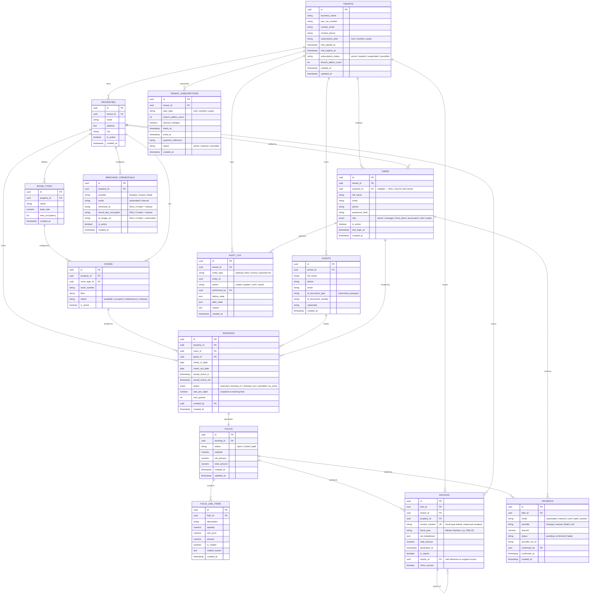

# Entity-Relationship Diagram — Hospitality SaaS

Complete schema reference. This is the source of truth for the backend build — every table, attribute, and relationship from `hospitality-saas-database-design.md`, rendered as one diagram.

## Constraints not expressible in ER notation

Mermaid's ERD syntax shows structure and cardinality but can't show `CHECK` constraints or partial uniqueness. These are enforced at the database level per `hospitality-saas-database-design.md` and must not be lost when this gets translated into actual migrations:

| Table | Constraint | Rule |
|---|---|---|
| `USERS` | `chk_owner_no_property` | `property_id` must be NULL if `role = 'owner'`, and NOT NULL for every other role |
| `BOOKINGS` | `chk_dates` | `check_out_date` must be strictly greater than `check_in_date` |
| `MERCHANT_CREDENTIALS` | `chk_mode_fields` | if `mode = 'automated'`: `merchant_id` and `secret_key_encrypted` required; if `mode = 'manual'`: `qr_image_url` required |
| `INVOICES` | uniqueness | `invoice_number` unique per `property_id`, not globally unique |
| `INVOICES`, `AUDIT_LOG` | append-only | application DB role gets `INSERT`+`SELECT` only — no `UPDATE`/`DELETE` grant, enforced at the database permission level, not just application code |

## Relationship notes

- `BOOKINGS ||--|| FOLIOS` is one-to-one: every booking has exactly one folio.
- `INVOICES ||--o{ INVOICES` ("reprint of") is a self-referencing relationship — a reprinted invoice is a new row pointing back to the original via `reprint_of`, never an edit to the original row.
- `USERS.property_id` participates in two different relationships depending on role: for `owner`, it's NULL (no property link); for every other role, it links to exactly one property. This is why the `PROPERTIES ||--o{ USERS` relationship is drawn as optional (`o{`) rather than mandatory.
- Tables intentionally not yet present: restaurant/POS tables (menu items, kitchen orders), HR/payroll tables (attendance, leave, payslips), and a dedicated CBMS sync/queue table. `INVOICES.cbms_synced` is a placeholder boolean until the real CBMS module is scoped.